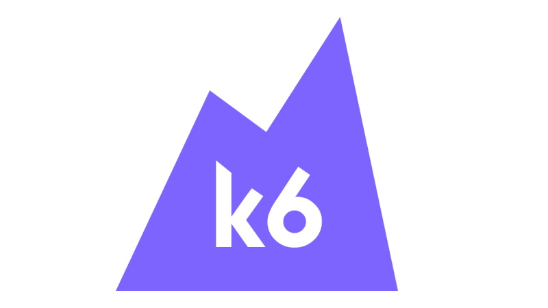

<div align="center">



# Exemple to use K6 with TypeScript

[](https://github.com/1freitas/perfTests/actions/workflows/samples.yml)

</div>
This repository provides the initial structure of the k6 project with using TypeScript and is based in the template of GrafanaLabs.
For more details about this template (used typescript in K6 scripts) access [the page of template](https://github.com/grafana/k6-template-typescript).

## Installation

Clone this repository on your local machine and install the prerequisites and dependencies (defined in [`package.json`](./package.json))

### Prerequisites

-   [k6](https://k6.io/docs/getting-started/installation)
-   [NodeJS](https://nodejs.org/en/download/)
-   [Yarn](https://yarnpkg.com/getting-started/install) (optional)

### Install dependencies

```bash
$ npm install
```

or using yarn

```bash
$ yarn install
# installed by npm
$ .\node_modules\yarn\bin\yarn webpack
```

## Running the test

To run a test written in TypeScript, we first have to transpile the TypeScript code into JavaScript and bundle the project

```bash
$ npm run start
```

or using Yarn

```bash
$ yarn webpack
# can be necessary set the path of node_modules to yarn
$.\node_modules\yarn\bin\yarn webpack
```

This command creates the final test files to the `./dist` folder.

Once that is done, we can run our script the same way we usually do, for instance:

```bash
$ k6 run dist/get-200-status-test.js
```

## Writing own tests

House rules for writing tests:

-   The test code is located in `src` folder
-   The entry points for the tests need to have "_test_" word in the name to distinguish them from auxiliary files. You can change the entry [here](./webpack.config.js#L8).
-   If static files are required then add them to `./assets` folder. Its content gets copied to the destination folder (`dist`) along with compiled scripts.

### Transpiling and Bundling

By default, k6 can only run ES5.1 JavaScript code. To use TypeScript, we have to set up a bundler that converts TypeScript to JavaScript code.

This project uses `Babel` and `Webpack` to bundle the different files - using the configuration of the [`webpack.config.js`](./webpack.config.js) file.

If you want to learn more, check out [Bundling node modules in k6](https://k6.io/docs/using-k6/modules#bundling-node-modules).
